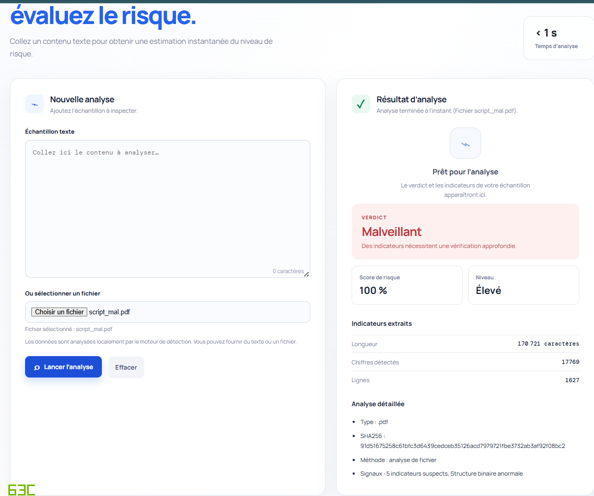
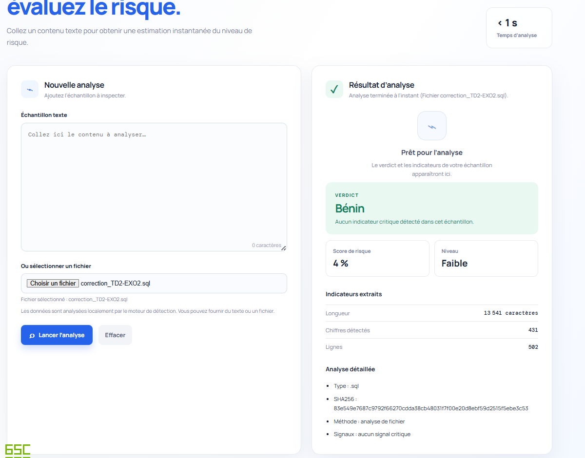

# 🛡️ Malware Detector


A **Machine Learning malware detection platform** built with a modular pipeline architecture.

The project combines:

- **Python** for the REST API, ML pipeline and orchestration
- **Flask** for the backend
- **scikit-learn** (Random Forest) for classification
- **SQLite** for the local training database
- **HTML / CSS / JavaScript** for the user interface

Detection, feature extraction and risk analysis are kept as independent, swappable components so the ML layer can evolve without touching the API.

---

# 📑 Table of Contents

- [🖼️ Live Example](#️-live-example)
- [✨ Key Features](#-key-features)
- [🏗️ Global Architecture](#️-global-architecture)
- [🔄 Detection Workflow](#-detection-workflow)
- [🛠️ Technologies](#️-technologies)
- [📂 Project Structure](#-project-structure)
- [⚙️ Installation](#️-installation)
- [🚀 Running the Application](#-running-the-application)
- [🧠 Machine Learning Pipeline](#-machine-learning-pipeline)
- [🌐 REST API](#-rest-api)
- [🧪 Testing](#-testing)
- [🔐 Security Considerations](#-security-considerations)
- [🧪 Malware Sample Safety](#-malware-sample-safety)
- [📝 Logging & Observability](#-logging--observability)
- [🗺️ Roadmap](#️-roadmap)
- [🤝 Contributing](#-contributing)
- [⚖️ Disclaimer](#️-disclaimer)
- [📄 License](#-license)
- [👨‍💻 Author](#-author)

---

# 🖼️ Live Example

Real outputs from the web interface (`évaluez le risque`), showing the detection engine classifying two different files.

## 🔴 Malicious Sample Detected



`script_mal.pdf` → **Verdict: Malveillant** · Score **100%** · Niveau **Élevé**
5 indicateurs suspects, structure binaire anormale

---

## 🟢 Benign Sample Confirmed



`correction_TD2-EXO2.sql` → **Verdict: Bénin** · Score **4%** · Niveau **Faible**
Aucun signal critique détecté

> Each analysis returns the file type, SHA-256 hash, analysis method, and a breakdown of detected indicators — instantly, in under a second.

---

# ✨ Key Features

| Feature                | Description                                               |
| ---------------------- | --------------------------------------------------------- |
| 🧠 ML Detection        | Classifies samples using a trained Machine Learning model |
| 🌲 Random Forest       | Default classification algorithm                          |
| 🔬 Feature Extraction  | Extracts numerical/static characteristics from samples    |
| 🎯 Risk Scoring        | Converts detection results into a risk assessment         |
| 🔎 Hash Analysis       | Allows analysis based on SHA-256 hashes                   |
| 📁 File Scanning       | Supports file uploads through the REST API                |
| 🌐 REST API            | Flask-based API for programmatic integration              |
| 🏋️ Model Training      | Training can be triggered through the API                 |
| 📊 Model Evaluation    | Accuracy and classification reports                       |
| 🗄️ SQLite Dataset      | Local database generation for ML training                 |
| 📝 Logging             | Training jobs generate stdout/stderr/status information   |
| 🔐 Training Protection | Optional `TRAIN_KEY` authentication                       |
| 🧪 Testing             | Unit tests using `pytest`                                 |
| 🖥️ Web Interface       | Static frontend served through Flask                      |

---

# 🏗️ Global Architecture

```text
                      Client / UI
                          │
                          ▼
                      Flask API
                     app/app.py
                          │
           ┌──────────────┼──────────────┐
           ▼              ▼              ▼
      Feature         Malware          Risk
      Extractor       Detector        Analyzer
           │              │
           │              ▼
           │        ML Model
           │        Random Forest
           ▼
     Feature Dataset
           │
           ▼
     SQLite / SQL
     Training Data
```

---

# 🔄 Detection Workflow

```text
Sample / Hash
     │
     ▼
Feature Extraction
     │
     ▼
Feature Vector
     │
     ▼
ML Model
     │
     ▼
Prediction
     │
     ▼
Detection Score
     │
     ▼
Risk Analysis
     │
     ▼
JSON API Response
```

The system separates **feature extraction**, **classification** and **risk analysis** so that the Machine Learning layer can evolve independently from the API.

---

# 🛠️ Technologies

- Python 3
- Flask
- scikit-learn
- XGBoost
- NumPy
- Joblib
- SQLite
- MySQL/MariaDB-compatible SQL (source schema)
- Pytest
- HTML5 / CSS3 / JavaScript

---

# 📂 Project Structure

```text
Malware-Detector/
│
├── app/
│   ├── app.py
│   │
│   ├── routes/
│   │   ├── scan.py
│   │   ├── dashboard.py
│   │   └── auth.py
│   │
│   ├── services/
│   │   ├── feature_extractor.py
│   │   ├── malware_detector.py
│   │   └── risk_analyzer.py
│   │
│   └── models/
│       ├── User.py
│       ├── Scan.py
│       ├── Feature.py
│       └── Malware.py
│
├── ml/
│   ├── preprocess.py
│   ├── train.py
│   ├── evaluate.py
│   │
│   ├── models/
│   │   └── random_forest.pkl
│   │
│   └── data.db                # generated locally, not versioned
│
├── database/
│   └── schema.sql
│
├── data/
│   └── datasets/
│
├── tests/
│   └── ...
│
├── static/
│   └── ...
│
├── running items/
│   ├── requirements.txt
│   └── ...
│
├── .gitignore
├── README.md
└── LICENSE
```

**`app/`** — Flask application and application-layer logic
**`ml/`** — Machine Learning pipeline (preprocessing, training, evaluation, persisted models)
**`database/`** — original SQL schema and training-data source
**`tests/`** — automated tests for application and ML components
**`static/`** — frontend assets served by Flask

---

# ⚙️ Installation

## 1. Clone the repository

```bash
git clone https://github.com/<YOUR_USERNAME>/<REPOSITORY>.git
cd <REPOSITORY>
```

## 2. Create a virtual environment

**Windows**

```powershell
python -m venv .venv
.\.venv\Scripts\Activate.ps1
```

**Linux / macOS**

```bash
python3 -m venv .venv
source .venv/bin/activate
```

## 3. Install dependencies

```bash
pip install -r "running items/requirements.txt"
```

Expected dependencies include:

```text
Flask
scikit-learn
joblib
numpy
xgboost
pytest
```

---

# 🚀 Running the Application

```bash
python app/app.py
```

The Flask development server listens on:

```text
http://localhost:5000
```

Alternatively, if the project packaging supports module execution:

```bash
python -m app.app
```

---

# 🧠 Machine Learning Pipeline

## Training

```text
Dataset
    │
    ▼
Preprocessing
    │
    ▼
Feature Matrix
    │
    ▼
Train/Test Split
    │
    ▼
Random Forest
    │
    ▼
Evaluation
    │
    ▼
Model Serialization
```

Trigger training:

```bash
python ml/train.py
```

The trained model is persisted at `ml/models/random_forest.pkl`.

## Evaluation

`ml/evaluate.py` provides utilities for:

- Accuracy
- Precision
- Recall
- F1-score
- Classification report

> For a cybersecurity classifier, **accuracy alone is not sufficient**. False negatives are particularly critical, since a malicious sample misclassified as benign represents a real security risk.

---

# 🔌 Detection Service

```text
app/services/malware_detector.py
```

Exposes functionality conceptually equivalent to:

```python
predict(features)
predict_from_hash(hash)
```

The risk-analysis layer interprets the prediction into a higher-level security assessment:

```json
{
  "result": "malware",
  "score": 0.94,
  "risk": "high",
  "sha256": "...",
  "features": {}
}
```

---

# 🌐 REST API

Base URL:

```text
http://localhost:5000
```

### `POST /api/scan`

**File upload**

```bash
curl -F "file=@/path/to/sample.exe" \
     http://localhost:5000/api/scan
```

**JSON request**

```bash
curl -X POST \
     http://localhost:5000/api/scan \
     -H "Content-Type: application/json" \
     -d "{\"sample\":\"0123456789abcdef...\"}"
```

Response:

```json
{
  "result": "malware",
  "score": 0.91,
  "risk": "high",
  "sha256": "..."
}
```

### `GET /api/models`

```bash
curl http://localhost:5000/api/models
```

```json
{
  "model_loaded": true,
  "model_path": "ml/models/random_forest.pkl"
}
```

### `GET /api/features`

```bash
curl "http://localhost:5000/api/features?hash=<SHA256>"
```

### `POST /api/train`

```bash
curl -X POST http://localhost:5000/api/train
```

With `TRAIN_KEY` configured:

```bash
curl -X POST \
     http://localhost:5000/api/train \
     -H "X-TRAIN-KEY: YOUR_TRAIN_KEY"
```

```json
{
  "started": true,
  "pid": 12345,
  "stdout": "ml/train_stdout.log",
  "stderr": "ml/train_stderr.log"
}
```

### `GET /api/train/status`

```bash
curl http://localhost:5000/api/train/status
```

---

# 🧪 Testing

```bash
pytest -q      # quiet
pytest -v      # verbose
```

Testing should be extended whenever a new detection rule, feature extractor, API endpoint, or ML component is introduced.

---

# 🔐 Security Considerations

## Training endpoint protection

```powershell
$env:TRAIN_KEY="your-secret-key"
```

```text
X-TRAIN-KEY: your-secret-key
```

## Production recommendations

Do **not** expose the development Flask server directly to the public Internet. Consider:

- Reverse proxy (Nginx)
- HTTPS/TLS
- Strong authentication
- Rate limiting & request-size limits
- Input validation
- Structured logging
- Process isolation / containerization
- Network segmentation
- Secret management
- Restricted filesystem permissions
- Malware-sample sandboxing

---

# 🧪 Malware Sample Safety

**❌ Do not**

- Execute unknown samples on your personal machine
- Open suspicious executables directly
- Upload confidential samples to public services
- Store malware alongside sensitive personal files
- Run analysis with unnecessary administrator privileges

**✅ Prefer**

- Isolated virtual machines
- Disposable analysis environments
- Network isolation & snapshots
- Dedicated test datasets
- Sandboxed execution environments
- Restricted permissions

> The current project primarily focuses on **static/ML-based analysis** and should not be considered a complete malware sandbox.

---

# 📝 Logging & Observability

```text
ml/
├── train_stdout.log
├── train_stderr.log
├── train.pid
└── train_status.json
```

For production deployments, consider: Python `logging`, JSON structured logs, log rotation, centralized log collection, metrics, health checks, monitoring dashboards.

---

# 🗺️ Roadmap

**Current**

- [x] Flask REST API
- [x] File/hash scanning
- [x] Feature extraction layer
- [x] Random Forest model
- [x] Model persistence
- [x] SQLite training database
- [x] Training endpoint & status endpoint
- [x] Basic automated tests
- [x] Risk analysis service

**Planned**

- [ ] Advanced model evaluation dashboard
- [ ] Automated model comparison
- [ ] Advanced PE feature extraction
- [ ] ROC-AUC / PR-AUC evaluation
- [ ] Expanded test coverage
- [ ] Complete API authentication
- [ ] OpenAPI documentation
- [ ] Docker deployment
- [ ] CI/CD pipeline
- [ ] Model monitoring
- [ ] Automated model versioning
- [ ] Feature importance visualization
- [ ] Dedicated malware sandbox integration

---

# 🤝 Contributing

```bash
git checkout -b feature/my-feature
# make your changes
git add .
git commit -m "feat: add my feature"
git push origin feature/my-feature
```

Then open a Pull Request.

**Guidelines**

- Keep modules focused and maintainable
- Add tests for critical functionality
- Document public API changes
- Avoid committing secrets or generated datasets
- Follow the existing project structure
- Explain significant ML changes and include evaluation results

---

# 🚫 Recommended `.gitignore`

```gitignore
# Python
__pycache__/
*.py[cod]

# Virtual environments
.venv/
venv/
env/

# Environment variables
.env
.env.*

# ML generated files
ml/data.db
ml/train_stdout.log
ml/train_stderr.log
ml/train.pid
ml/train_status.json

# Python tooling
.pytest_cache/
.mypy_cache/

# IDE
.vscode/
.idea/

# OS
.DS_Store
Thumbs.db
```

---

# ⚖️ Disclaimer

This software is provided for **educational, research and authorized cybersecurity analysis purposes**. The authors and contributors are not responsible for damage, data loss, system compromise or misuse resulting from the software. Only analyze files, systems and datasets for which you have appropriate authorization.

---

# 📄 License

No explicit license is currently included in the repository. Before distributing or using the project commercially, add an appropriate `LICENSE` file and verify the licensing requirements of source datasets, third-party libraries, pre-trained models, generated model artifacts, and external APIs.

---

# 👨‍💻 Author

**Amine Aymen Senbati**

Étudiant en Cybersécurité.
